  

<!-- project overview -->

> Apexo is a next-generation, AI-agent business assistant built to automate, optimize, and augment internal operations for modern organizations.
>
> By intelligently participating in meetings, managing tasks, and automating workflows, Apexo bridges the gap between human collaboration and artificial intelligence enabling businesses to operate smarter, faster, and more efficiently.

  

<!-- System Design -->

### ER Diagram

### Component Diagram

### Flow Diagram

  

<!-- Project Highlights -->

 

- ### Real-time Meeting Participation
  Transcribing discussions, summarizing key points, and automatically extracting actionable tasks.
- ### Task Management Assistance
  Empowering employees to track, update, and query their tasks seamlessly through AI interactions.
- ### Workflow Automation
  Handling repetitive administrative duties like reminders, reporting, and follow-ups with minimal human input.
- ### Future-Proof Expansion
  Designed with modularity to integrate advanced AI capabilities such as AI-driven hiring assistance and internal knowledge querying.

  

<!-- Demo -->

### Screens Demo

| Login screen                              | Register screen                            |
| ----------------------------------------- | ------------------------------------------ |
| 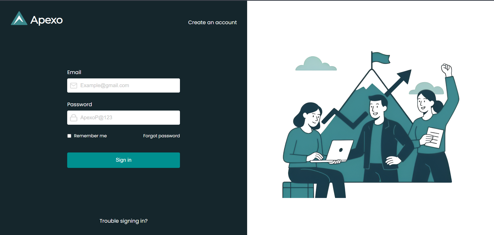 | 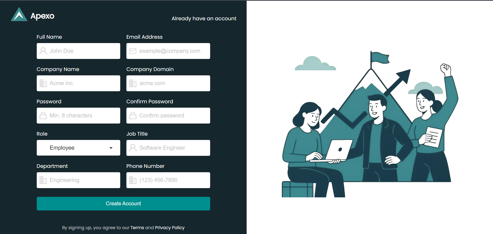 |

| Landing Page                              | Dashboard                             |
| ----------------------------------------- | ------------------------------------- |
| 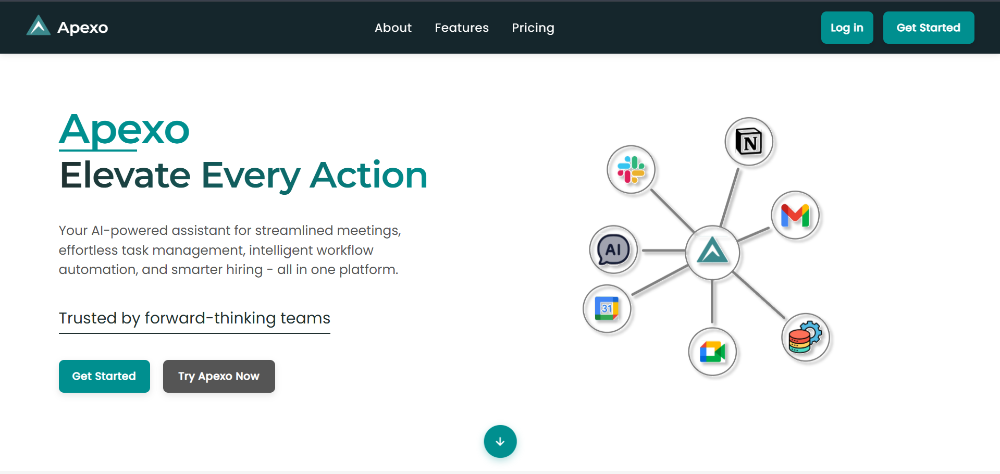 | 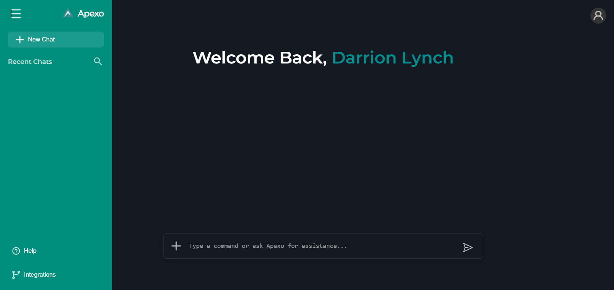 |

| Login Demo                              | Dashboard Demo                            |
| --------------------------------------- | ----------------------------------------- |
| 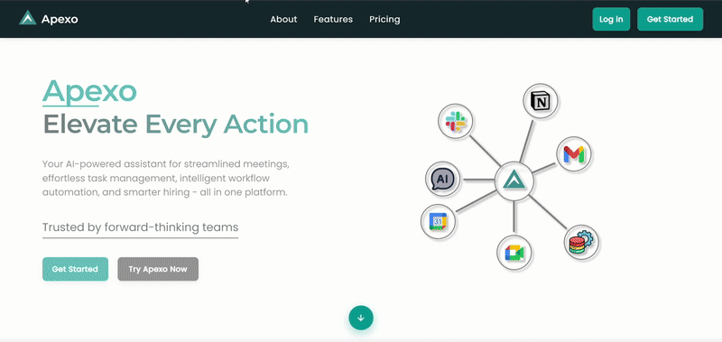 | 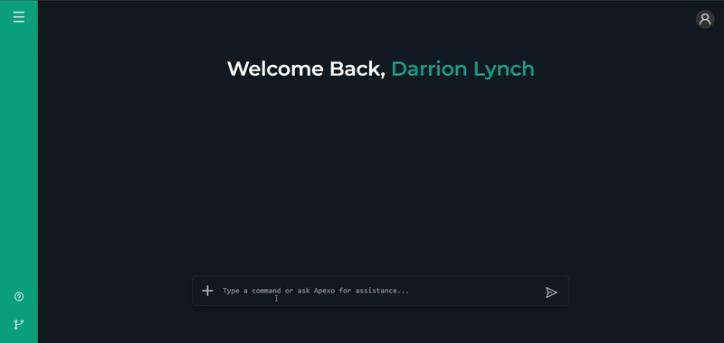 |

  

<!-- Development & Testing -->

| Services                                      | Validation                                 | Testing                               |
| --------------------------------------------- | ------------------------------------------ | ------------------------------------- |
| 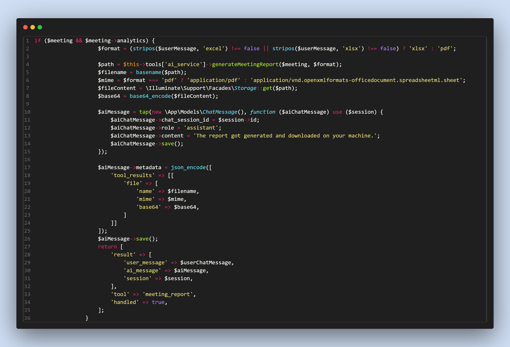 | 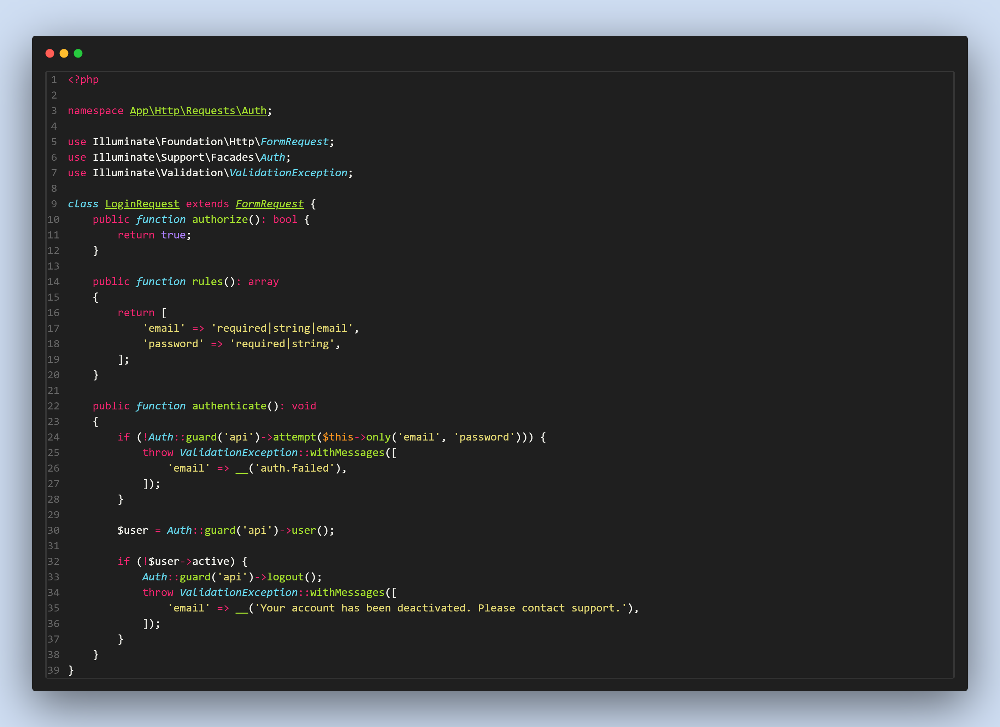 | 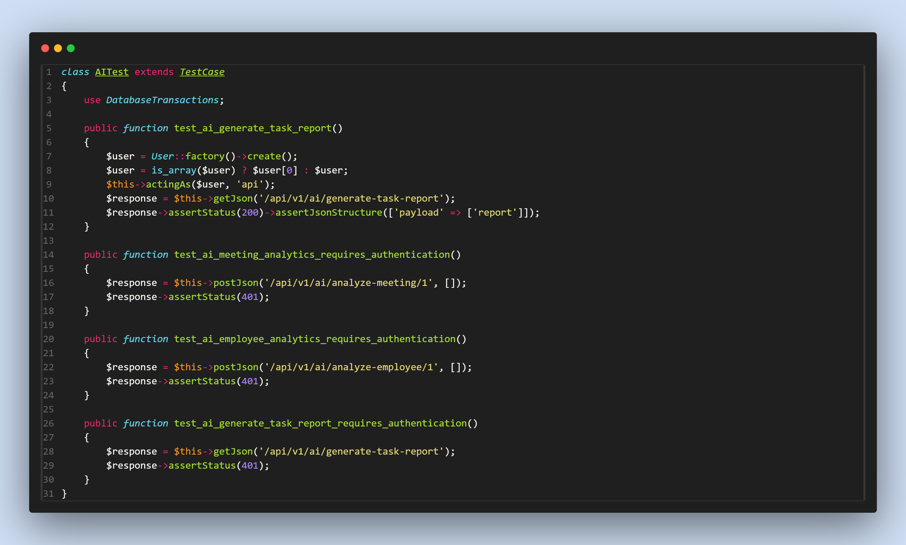 |

| TestCases                             |
| ------------------------------------- |
| 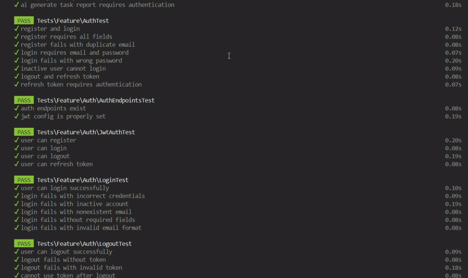 |

  

<!-- AI powered App -->

- **Seamless Prism & AI Integration:** Prism orchestrates OpenAI-powered agents to interpret user input and intelligently trigger backend tools, functions, and workflows.
- **Dynamic Tool Invocation:** The AI agent can call custom tools and dispatch Laravel service methods in real time, automating business logic and data operations based on natural language requests.
- **Context-Aware Automation:** All AI-driven actions are contextually aware, leveraging user roles and permissions to ensure secure, relevant, and efficient automation across the platform.

| Prism tool processing                    |
| ---------------------------------------- |
| 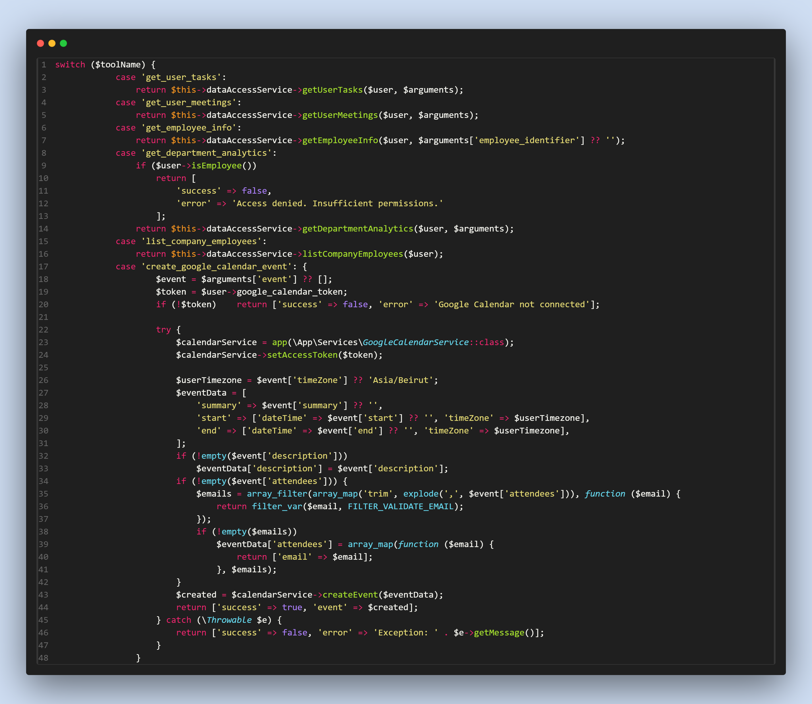 |

  

<!-- Deployment -->

### Deployment Diagram

  

| Postman API 1                                                  | Postman API 2                                                | Postman API 3                                                |
| -------------------------------------------------------------- | ------------------------------------------------------------ | ------------------------------------------------------------ |
|  |  |  |

  
