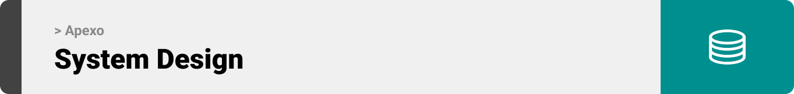
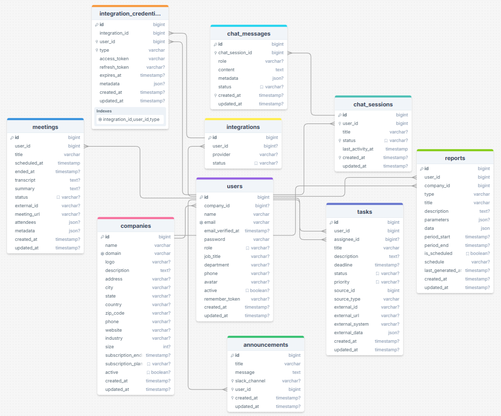
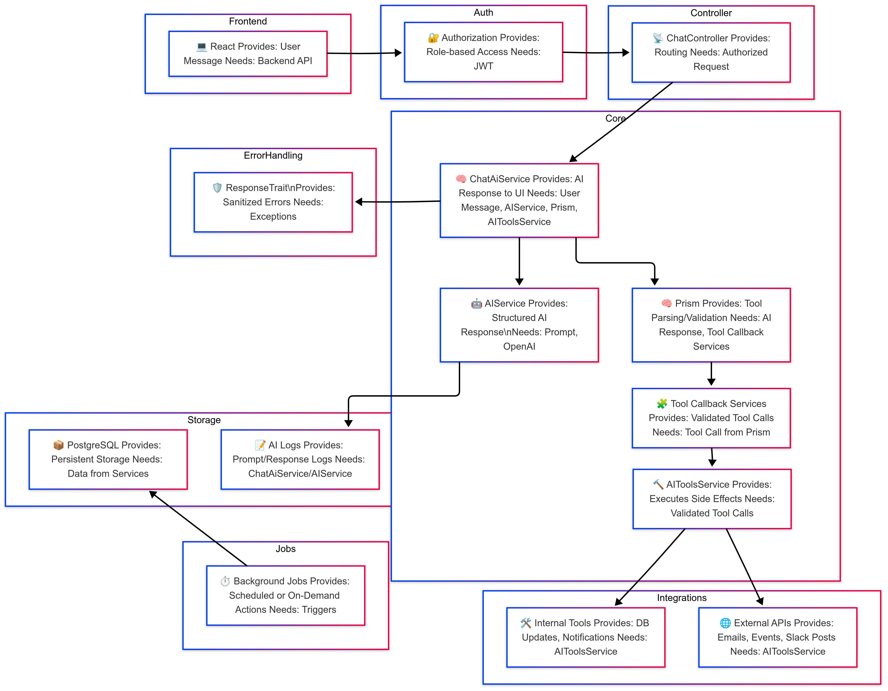
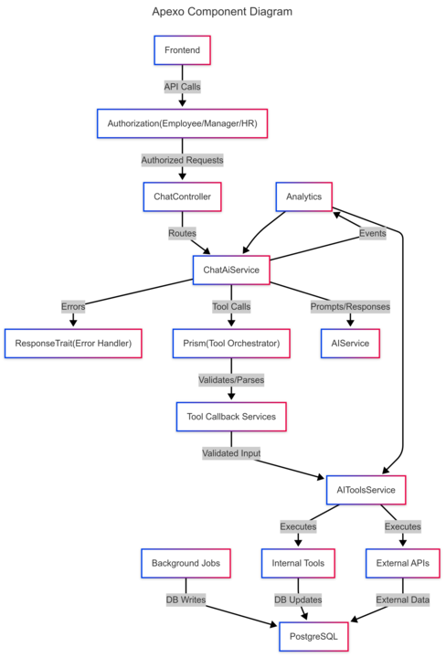
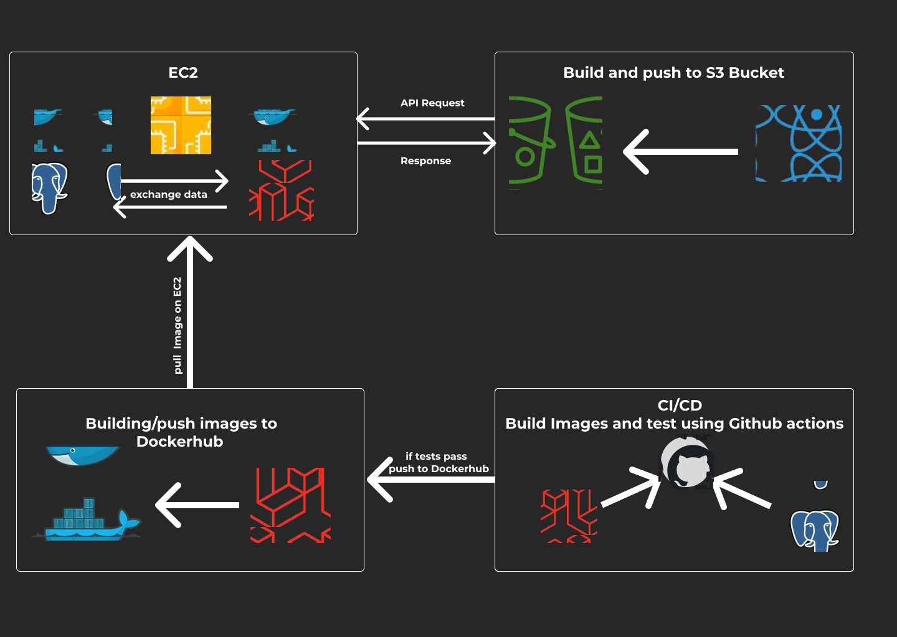
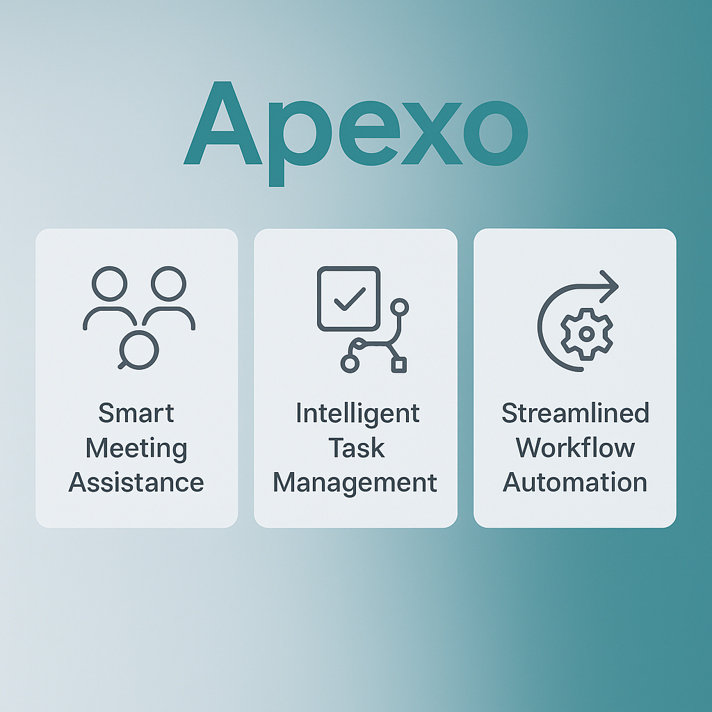

  

<!-- project overview -->

> Apexo is a next-generation, AI-agent business assistant built to automate, optimize, and augment internal operations for modern organizations.
>
> By intelligently participating in meetings, managing tasks, and automating workflows, Apexo bridges the gap between human collaboration and artificial intelligence enabling businesses to operate smarter, faster, and more efficiently.

  

<!-- System Design -->

### ER Diagram

### Component Diagram

### Flow Diagram

### Deployment Diagram

  

<!-- Project Highlights -->

 
- ### Real-time Meeting Participation
  Transcribing discussions, summarizing key points, and automatically extracting actionable tasks.
- ### Task Management Assistance
  Empowering employees to track, update, and query their tasks seamlessly through AI interactions.
- ### Workflow Automation
  Handling repetitive administrative duties like reminders, reporting, and follow-ups with minimal human input.
- ### Future-Proof Expansion
  Designed with modularity to integrate advanced AI capabilities such as AI-driven hiring assistance and internal knowledge querying.

  

<!-- Demo -->

### User Screens (Mobile)

| Login screen                            | Register screen                       | Register screen                       |
| --------------------------------------- | ------------------------------------- | ------------------------------------- |
|  |  |  |

### Admin Screens (Web)

| Login screen                            | Register screen                       |
| --------------------------------------- | ------------------------------------- |
|  |  |

  

<!-- Development & Testing -->

### Add Title Here

| Services                                | Validation                            | Testing                               |
| --------------------------------------- | ------------------------------------- | ------------------------------------- |
|  |  |  |

  

<!-- Deployment -->

### Add Title Here

- Description here.

| Postman API 1                           | Postman API 2                         | Postman API 3                         |
| --------------------------------------- | ------------------------------------- | ------------------------------------- |
|  |  |  |

  
